# Drive the Future: Predicting Used Car Prices 

## Objective

This repository offers an in-depth analysis of a reduced-size Kaggle dataset containing information on 426,000 used cars. Its objective is to identify the factors influencing used car pricing through exploratory data analysis and machine learning models, following the CRISP-DM framework https://en.wikipedia.org/wiki/Cross-industry_standard_process_for_data_mining. Accurate predictions of used car prices aim to benefit stakeholders, including car dealerships, individual sellers and buyers, and financial institutions.

## Executive Summary

### Key Findings

Key features influence the price of used cars. While there is no linear relationship between the price of a used car and other features, non-linear relationships, including polynomial features of independent variables, significantly influence the target price of used cars.

The features ranked by permutation importance include the combined impact of price and year of manufacture, followed by the year of manufacture alone. Other significant factors are the number of cylinders, the interactions between year and cylinders, year and odometer, price and odometer, and price and cylinders. Additionally, fuel type (diesel and gas), specific states such as Oklahoma, truck models, manufacturers like Mitsubishi and Porsche, and transmission types (automatic and manual), especially in sedan variants, also play important roles.

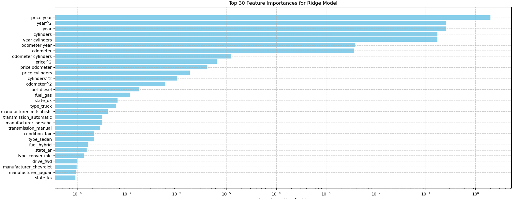

### Insights and Implications

It is noteworthy that electric cars, paint colors, and a clean title status were not found to significantly influence the price of cars within the studied years between 2000 to 2020.

#### Interesting Findings

| **Feature**                                                         | **Recommendation**                                                                                                                                                                    | **Feature Coefficient**                                    | **Impact on used Car price** | **Interpretation**                                                                              |
|---------------------------------------------------------------------|---------------------------------------------------------------------------------------------------------------------------------------------------------------------------------------|------------------------------------------------------------|------------------------------|-------------------------------------------------------------------------------------------------|
| Price and Year                                                      | Consider Pricing Strategies that consider both features comprehensively                                                                                                               | 10841.8756 (price and year combined) 3880.2149 (year only) | Positive influence           | Year of manufacture tends to increase used car price                                            |
| Cylinders                                                           | Promote higher cylinder car models in the inventory as they are perceived to offer better performance with increased power                                                            | 3207.6857                                                  | Positive influence           | Higher number of cylinders increases used car price                                             |
| Odometer and Year                                                   | Promote models in inventory that have a lower mileage with a recent year of manufacture as they are perceived to have a longer potential lifespan                                     | 463.6157                                                   | Positive influence           | Lower mileage on a relatively recent car increases its price                                    |
| Fuel diesel                                                         | With better fuel efficiency, diesel cars in the inventory will attact buyers looking to save on fuel cost over the long term                                                          | 3.1872                                                     | Positive influence           | Higher demand for diesel cars results in higher resale price for a used car                     |
| Type Truck with drive 4wd, Convertible                              | Increase the inventory with trucks that offer off-road performance and convertibles with their seasonal appeal                                                                        | 1.9728 0.8858 Drive 4wd- 0.5652                            | Positive influence           | Features that contribute to higher resale prices                                                |
| State Ok, Ar                                                        | Research regional demand and local market before pricing cars in inventory                                                                                                            | 1.8968 0.7263                                              | Positive influence           | Regional preferences increase used car prices                                                   |
| Manufacturer – Mitsubhishi, Aston Martin, Porsche                   | With perceived reliability and lower maintenance, having branded and luxury cars in the inventory will increases sales                                                                | 1.4486 1.3874 1.1066                                       | Positive influence           | Brands that result in appreciation of used car prices                                           |
| Year and Cylinders, Higher odometer mileage, Odometer and Cylinders | Older cars with lower cylinders and higher mileage tend to sell less. Consider careful pricing strategies also factoring in state/region with its demand                              | -3201.4618 -462.7157 -26.1842                              | Negative influence           | Older cars with higher mileage and low cylinder count result in depreciation of used car prices |
| Automatic Transmission, Fuel type of gas and hybrids, Sedan Type    | Consider including these depreciating features in your pricing strategy. Offer incentives and limited time promotions can make these used cars attractive to buyers increasing sales. | -1.3445 Gas -2.5235 Hybrids -0.8815 Sedan type -1.0686     | Negative influence           | Features that result in depreciation of used car prices                                         |
| Manufacturer – Hyundai, Nisaan                                      | Factor in brands that decrease resale prices when pricing the inventory                                                                                                               | -0.0027 -0.0053                                            | Negative influence           | Brands that result in depreciation of used car prices                                           |

### 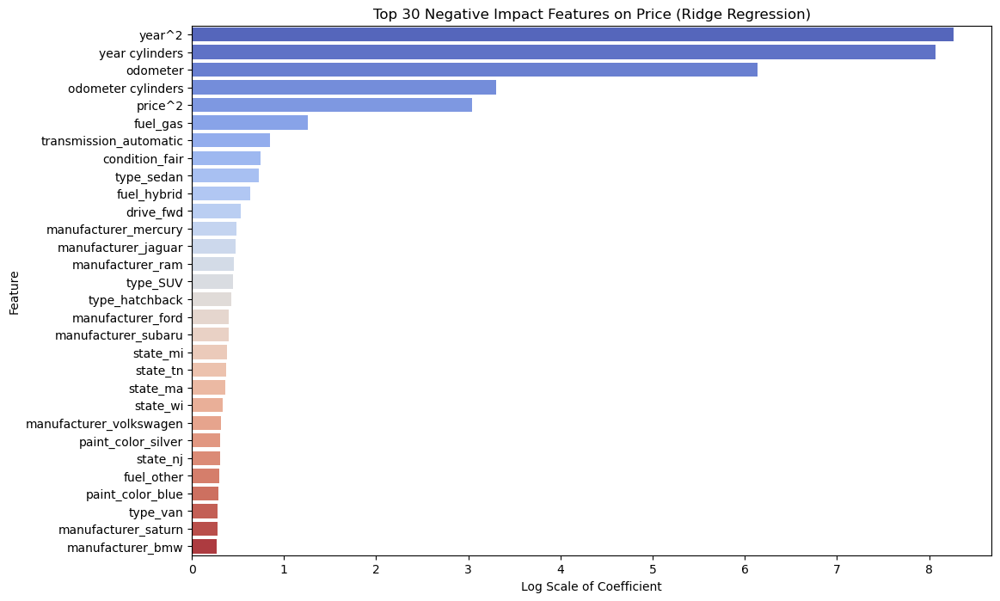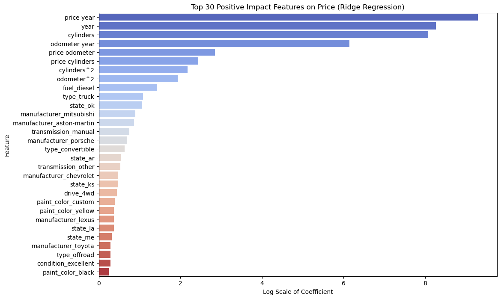

### Recommendations

Based on features identified as having higher importance in influencing the price of used cars, here are some recommendations.

-   **Focus on Pricing Strategy**: Given the strong influence of price and year of manufacture together, optimize pricing strategies that consider both factors comprehensively.

-   **Highlight Year of Manufacture**: Emphasize the year of manufacture prominently in vehicle listings and marketing materials, as it significantly impacts pricing.

-   **Manage Mileage**: Since odometer (mileage) is influential, prioritize vehicles with lower mileage or provide transparency and justification for higher mileage vehicles.

-   **Consider Fuel Efficiency**: Given the impact of fuel type (diesel and gas), consider promoting vehicles with fuel-efficient technologies or highlighting their cost-effectiveness.

-   **Regional Considerations**: Recognize the influence of specific states like Oklahoma and tailor marketing or pricing strategies accordingly for regional markets.

-   **Model and Transmission Preferences**: Cater to preferences for specific truck types, manufacturers like Mitsubishi and Porsche, and transmission types (automatic and manual) by ensuring a diverse inventory that meets varied customer preferences.

Continue reading for an in-depth analysis of the model evaluation that underpins the findings and recommendations discussed.

## GitHub Repository Structure

-   https://github.com/diptiaswath/usedCarsPricePrediction/

-   **Notebook:** used_price_predictor.ipynb

-   **Data:** data/vehicles.csv
  
-   **Images:** images/

-   **Reports:** **a)** README.md **b)** Used Cars Price Prediction.docx for a word document of the full report

## Deep Dives: Unveiling Insights with the CRISP-DM Framework

## Business Use Case: Predicting Used Car Prices

The used car market is highly dynamic, with prices influenced by numerous factors such as vehicle year of manufacture, odometer mileage, condition, make and model, location, and market trends. A used car prediction model helps with the following objectives:

-   Optimizes Pricing: Provide accurate price estimates to help sellers set competitive and fair prices.

-   Enhances Customer Trust: Build trust with buyers by offering transparent and data-driven pricing.

-   Increases Sales Efficiency: Enable quicker sales cycles by reducing the time needed to price vehicles.

-   Risk Management: Assists financial institutions in making informed lending decisions.

## Data Understanding

### Dataset Description

The original Kaggle data-set of 3 million used cars was reduced to a 426880 entries to improve speed with data processing. This data-set with 18 features includes –

1.  **id:** A unique identifier for each car listing.

2.  **region:** The geographic region where the car is listed.

3.  **price:** The listed price of the car in dollars.

4.  **year:** The manufacturing year of the car.

5.  **manufacturer:** The manufacturer or brand of the car (Ford, Dodge etc).

6.  **model:** The model name of the car.

7.  **condition:** The condition of the car (New, Good, Fair, Salvage).

8.  **cylinders:** The number of cylinders in the car’s engine.

9.  **fuel:** The type of fuel the car uses (Gas, Diesel, Electric, Hybrid).

10. **odometer:** The mileage of the car which is distance traveled in miles.

11. **title_status:** The status of the car’s title (Clean, Salvage, Rebuilt).

12. **transmission:** The type of transmission (Automatic, Transmission, Manual).

13. **VIN:** The Vehicle Identification Number, a unique code used to identify individual motor vehicles.

14. **drive:** The type of drivetrain (4wd, fwd, rwd).

15. **size:** The size category of the car (Compact, Mid-size, Full-size).

16. **type:** The type or category of the car (Sedan, SUV, truck).

17. **paint_color:** The exterior color of the car’s paint.

18. **state:** The state where the car is listed.

### Dataset Exploration

-   Numeric Features – price, odometer, year

-   Categorical Features – region, manufacturer, model, condition, cylinders, fuel, title_status, transmission, VIN, drive, size, type, paint_color, state

### Explored distribution of Numeric Features

### Observations

-   Distribution of Price showed a skew toward \$0 prices

-   Distribution of Year of manufacturer showed a range inclusive of years 2000 - 2020

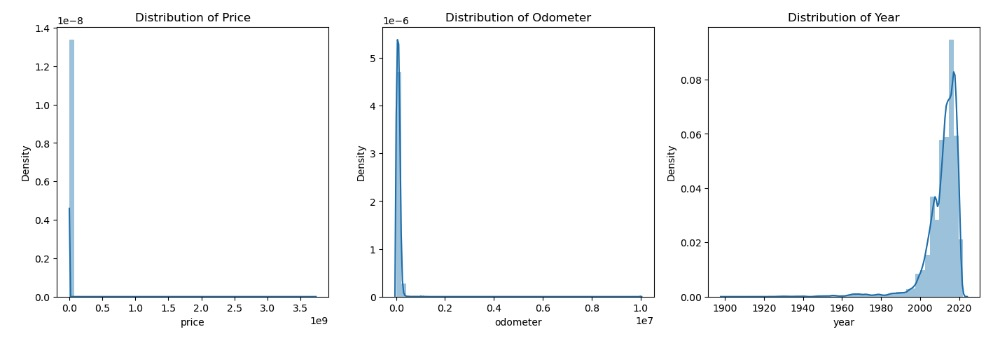

### Explored distributions of all Categorical Features

### Observations with unique values

-   Size of car: ['full-size' 'compact' 'mid-size' 'sub-compact']

-   Manufacturer: ['honda' 'ford' 'mitsubishi' 'mercedes-benz' 'audi' 'toyota' 'buick'

    'chevrolet' 'subaru' 'acura' 'nissan' 'chrysler' 'jeep' 'jaguar' 'gmc'

    'mazda' 'hyundai' 'ram' 'kia' 'lincoln' 'cadillac' 'dodge' 'lexus' 'bmw'

    'volkswagen' 'mini' 'volvo' 'mercury' 'infiniti' 'porsche'

    'harley-davidson' 'pontiac' 'saturn' 'rover' 'fiat' 'land rover' 'tesla'

    'ferrari' 'aston-martin' 'alfa-romeo']

-   Type ['SUV' 'pickup' 'truck' 'sedan' 'coupe' 'van' 'offroad' 'hatchback'

    wagon' 'convertible' 'mini-van' 'bus' 'other']

-   Transmission: ['automatic' 'manual' 'other']

-   Condition - ['good' 'like new' 'excellent' 'fair' 'new' 'salvage']

-   Cylinders ['4 cylinders' '6 cylinders' '8 cylinders' 'other' '10 cylinders'

    '5 cylinders' '3 cylinders' '12 cylinders']

-   Title Status ['clean' 'lien' 'rebuilt' 'salvage' 'missing' 'parts only']

-   Fuel ['gas' 'diesel' 'hybrid' 'other' 'electric']

-   Paint Color ['custom' 'silver' 'green' 'grey' 'black' 'white' 'blue' 'red' 'brown'

    'orange' 'yellow' 'purple']

-   Models, Region and State – This included a large selection of models across mmany regions and state

### Observations with Distribution of Year and Price of used cars across category features

With a 10K sample size, there were no visible linear relations between Car Price and Year of Manufacture with any of its categorical features or numerical features

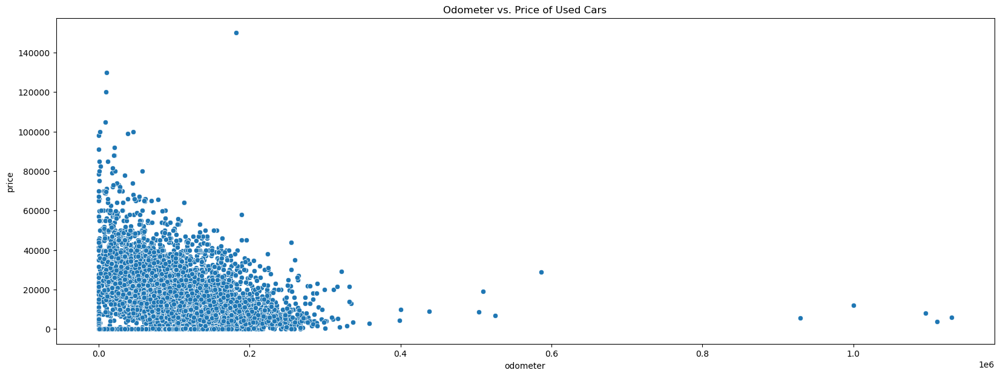

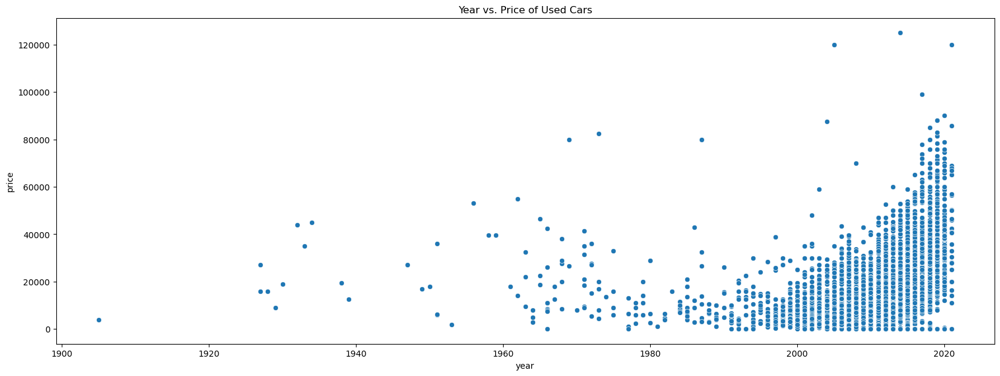

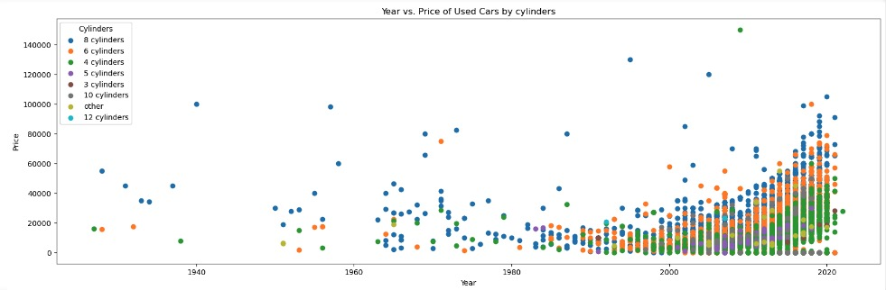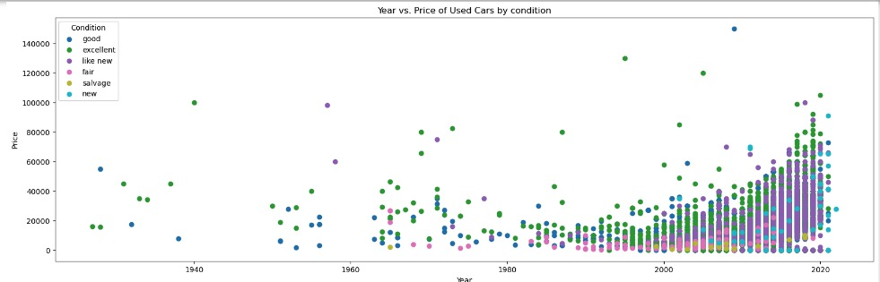

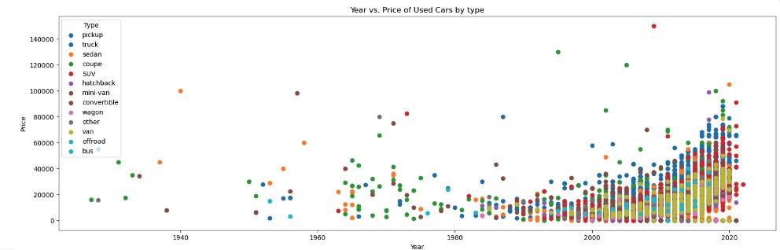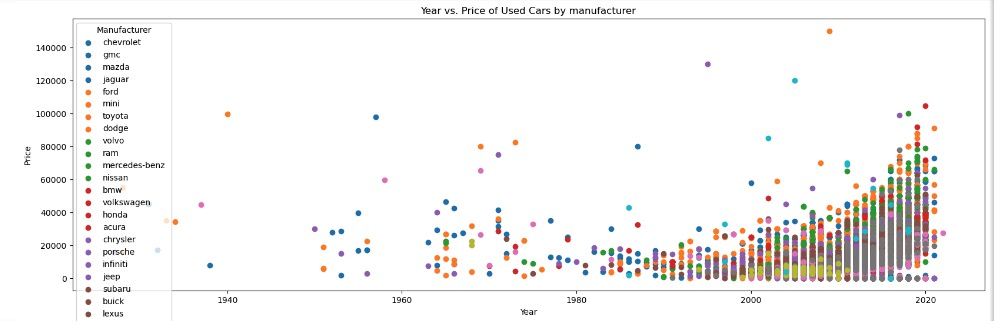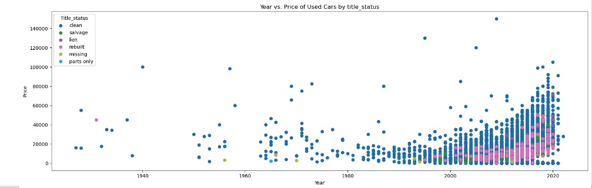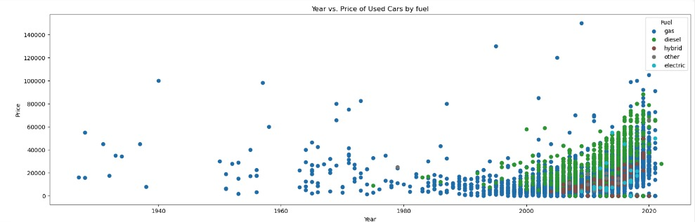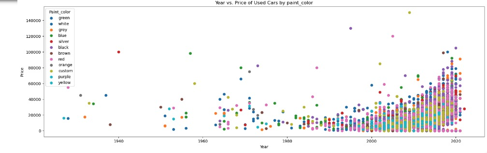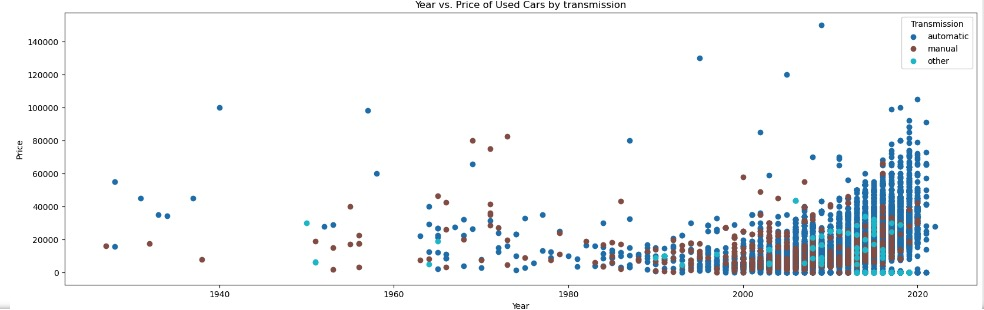

## Data Preparation and Preprocessing

This section walks us through step wise data preparation and processing steps that were performed.

-   Removal of skewed prices from data explorations

To address the skewed price distribution, retained prices between 2K – 80K USD. This effectively removed prices outside the selected lower and upper bound. DataSet size reduced from 426880 entries to about 372276 entries. This normalized the price, distributions as seen in plot below.

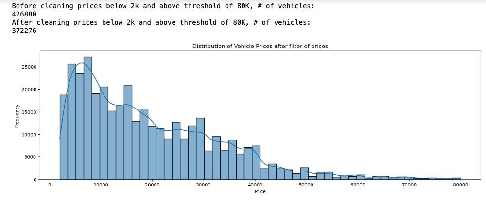

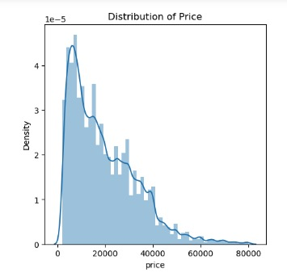

-   Dropped entries with missing values. This further reduced the data-set with the number of rows/entries as 31278.

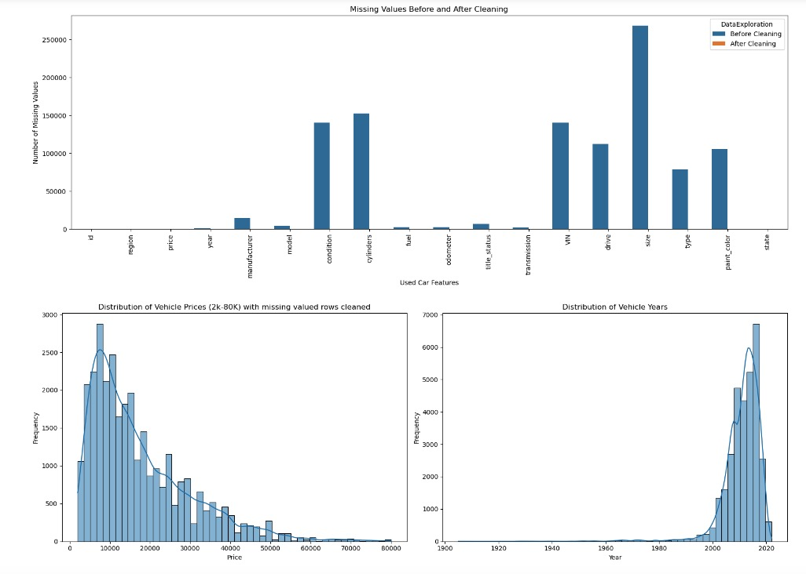

-   Outlier Analysis with Price and Odometer ranges

    Analyzed this reduced data-set of 31278 rows for Price and Odometer outliers. There were none found and the size of the data-set remains at 31278 rows.

    Attempted to see if a log transform and sqrt transform of Price and Odometer would change – however with no change observed, did not retain these transformations with Price and Odometer features.

    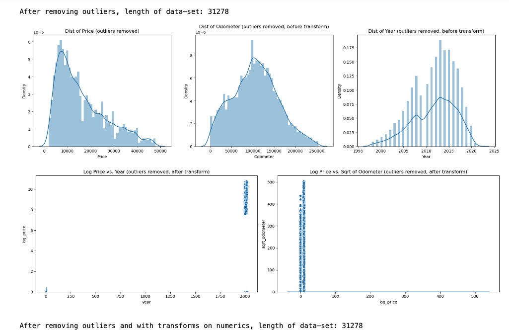

-   Reduced data-set size is now at 31278 rows with threshold price filters, missing rows cleaned and attempts to remove any outliers. Distribution of price in this data-set is as observed below.

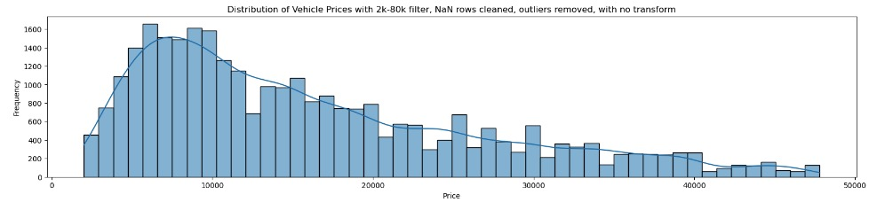

-   Transformed categorical feature cylinders to a numerical feature. Dropped category features model, and region with a large number of unique values. Instead, decided to retain manufacturer and state for similar information of a used car. Proceeded to also drop unique car identifiers – Id and VIN as well.

    This leaves us with 34868 rows and 14 columns

-   Checked numeric features for multi-collinearity with Variance Inflation Factor (VIF). With a VIF close to 1, this indicated there was no multi-collinearity between the numeric features.

-   Feature Engineering and Column Transformations

    **Numeric Features**:

    -  Imputes missing values with the median.

    -  Generates polynomial features of degree 2 for price, odometer, year, and cylinders.

    **Categorical Features**:

    -  Impute missing values with the most frequent value.

    -  One-hot encode size, manufacturer, fuel, title_status, type, transmission, condition, drive, paint_color, and state.

    With a column transformer, combined the preprocessing steps into one and transformed the dataset. Then, proceeded to create a data-frame with the transformed data. This resulted in a data-frame with 29072 rows with 157       features – excluding the first column.

## Model Building

With the used car dataset preprocessed and its features transformed, evaluated models with Ridge and Lasso Regression together with PCA and K-Means clustering combined with Ridge Regression. Ridge and Lasso Regression models performed better, both when a) using a subset of highly correlated features to Price, b) using all 157 features.

### Models considered for evaluation

-   Lasso with forward SFE: Model \#5 - Lasso regression model with forward feature Selection (SFE) helped identify the most important features influencing the price of a used car.

-   Ridge regression model: Model \#2 - was helpful to identify and rank the top 20 features with the highest positive and negative coefficients that influenced used car prices. This model had no significant overfitting or underfitting.

Model \#2 and Model \#5 regression models were trained and tested with a 80/20 data-set split. Hyper-parameters (alpha) were fine tuned with Grid Search combined with a 5-fold cross validation to optimize model performance and prevent over-fitting.

-   Ridge regression baseline model: Model \#1 - evaluated with a top-30 feature subset (features selected were highly correlated to price) also performed well in predicting used car prices with moderate variance. Model \#2 and \#5 were evaluated to see if this baseline model could be improved by reducing both bias and variance for better generalization.

### Best Model

The Ridge regression model (Model \#2) using ALL features, with a Test MSE = 286.8824 and a Train MSE = 265.29658.

### Models discarded for evaluation

-   Lasso Regression applied to a PCA-transformed dataset (Model \#3) exhibited very high MSE on both the training and testing sets, making it unsuitable for predicting used car prices. This model required approximately 120 principal components to retain 90% of the variance in the data. The regularization effect of Lasso Regression did not significantly improve the model's performance.

-   Lasso Regression with PCA and K-Means (Model \#4) also exhibited very high MSE on train and test data-sets. First, we used PCA to reduce the dimensionality of the dataset while retaining 90% of the variance. Next, applied K-means clustering to group the data into meaningful clusters. Finally, used Lasso Regression within each cluster to identify the most influential features and make predictions. This model appeared to cluster the same features deemed to be important from the Regression model into clusters but was not conclusive for predicting used car prices.

### Conclusion

We concluded that feature selection techniques combined with regularization, such as Lasso Regression, outperform dimensionality reduction techniques like PCA when predicting used car prices. The regularization provided by Ridge and Lasso effectively selected the most relevant features, leading to better model performance compared to using PCA for reducing dimensionality.

## Model Evaluation of Best Model with Ridge Regression

This best model performs well in predicting used car prices, exhibiting moderate variance.

With the Train and Test MSE both low and close to each other, it indicates that the model strikes a good balance between bias and variance, with no significant overfitting or underfitting.

Using 5-fold cross-validation, the best Train and best Test MSE values for the k-folds are also close to each other, further confirming the model's robustness and generalizability.

Learning curves also assist in visualizing how this model trades-off between bias and variance across different training set sizes. The plot demonstrates a pattern where both training and validation errors decrease and eventually converge, suggesting the model’s generalizes well with reduced variance.

### Evaluation Metrics

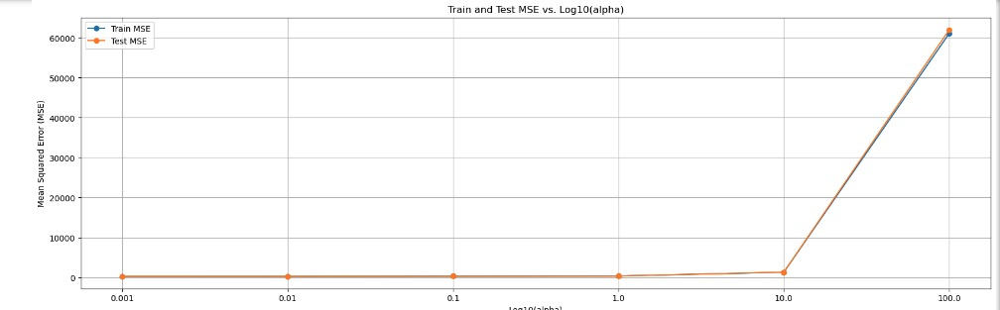 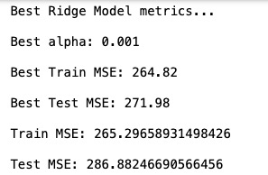

### Learning Curves

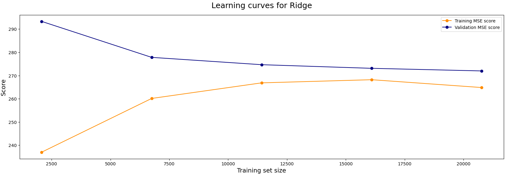

### Actual vs Predicted Prices

**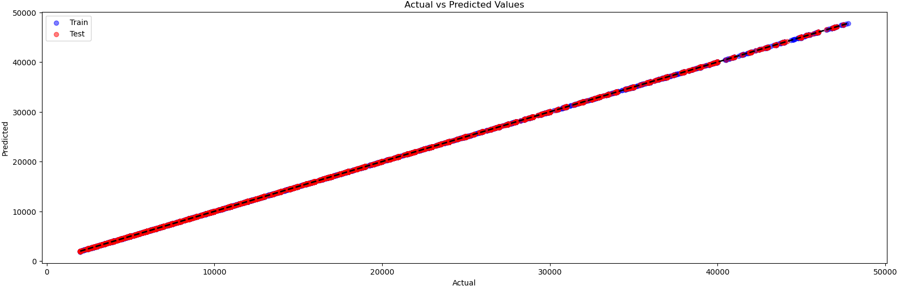**

### Conclusion

The best model evaluation provided several key insights into the features that influence used car prices. These are outlined in the Summary section at the start of this report.

## Future Work

-   Capture Seasonal Patterns to analyze and predict used car price fluctuations with the year of manufacture feature

-   Capture Geographical Price variations with region and state features to analyze if certain regions and state have more demand for certain car models, which in turn can influence used car prices
